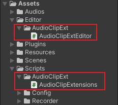

### Unity WebGL Recorder

----


最近做项目需要实现 Unity 发布到网页端，然后实现网页端录音并获取录音数据分析的功能。效果如下：


需要注意一下，使用的是 WebGL 兼容性较好的 2020.3.35f1c2 版本进行构建。

----


#### 一. 解决痛点一 —— AudioClip.GetData

- 在 WebGL 平台无法调用 `AudioClip.GetData(float[], int)` 获取音频片段的采样数据。这里通过如下两个脚本：

  

  通过对音频 AudioClip 片段进行 "预处理" 的方式，把其内部的数据包括：采样频率，通道，采样长度，播放长度等信息，保存到 StreamingAssets 文件夹下：

  

  通过如下的方式，生成这个 "预处理" 的数据文件：

  

  > 备注：要注意这里的 AudioClip 必须名称唯一，否则会报错。

----

- 对于预处理的文件，内容格式如下：

  

  - 第一行：samples，采样数据长度；
  - 第二行：channels，通道数；
  - 第三行：length，片段播放时长；
  - 第四行：frequency，播放频率；
  - 第五行：GetData 获取的 float[] 采样数据。

  在 WebGL 平台中，由于 "预处理" 文件在 StreamingAssets 文件夹下，会一起打包到 StreamingAssets 文件夹下，可以通过 UnityWebRequest 进行访问：

  

---

- 在脚本中，通过使用如下拓展方法 `AudioClip.GetData(UnityAction<bool, float[]>)` 替代原来的 `AudioClip.GetData(float[], int)` 。这里由于访问 "预处理" 文件的数据是使用 UnityWebRequest，会有访问的延迟，所以使用回调的方式。其中，这个方法第一个参数是是否读取成功，第二个参数是 GetData 的采样数据。代码如下：

  ``` C#
  // 已经经过预处理的 AudioClip
  AudioClip audioclip = ...;
  
  // 
  int samples = audioclip.samples;
  int channels = audioclip.channels;
  float length = audioclip.length;
  int frequency = audioclip.frequency;
  var coroutine = audioclip.GetData((r, datas) =>
  {
      StringBuilder build = new StringBuilder();
      build.AppendLine("当前的 AudioClip 读取状态：" + r);
      build.AppendLine("channels: " + channels);
      build.AppendLine("samples: " + samples);
      build.AppendLine("length: " + length);
      build.AppendLine("frequency: " + frequency);
      build.AppendLine("datas: ");
      build.AppendLine(string.Join(",", datas));
      print(build.ToString());
  });
  // 由于这样获取采样数据有延迟
  StartCoroutine(coroutine);
  ```

  具体的测试见项目中脚本 **TestAudioClipGetData**。

---


#### 二. 解决痛点二 —— WebGL Html5 录音

- 这边使用了其他大佬写的插件，参考连接如下：

  ``` reference
  https://github.com/xiangyuecn/Recorder
  ```

  前端部分的代码几乎来源于：

  ``` reference
  https://xiangyuecn.gitee.io/recorder/assets/%E5%B7%A5%E5%85%B7-%E4%BB%A3%E7%A0%81%E8%BF%90%E8%A1%8C%E5%92%8C%E9%9D%99%E6%80%81%E5%88%86%E5%8F%91Runtime.html?jsname=teach.realtime.encode_transfer_frame_pcm
  ```

---

- 这里对其进行一些整理，大致代码的逻辑都是相似的：

  

  这里使用了 Unity 默认的 Defult 模版修改而成，仅仅增加了如下几行代码：

  

  

---

- 在 Unity 部分，通过 **Recorder** 脚本中的相关方法对前端进行调用：
  - Start：开始录音；
  - Stop：结束录音；
  - GetAudioData：后台无法直接调用（private)，前端需要再结束录音时通过此方法进行回调处理数据；
  - PlayClip：播放当前录制的音频片段；
  - DownloadPCM16：下载录制音频片段的 PCM 16 格式文件；
  - DownloadWAV：下载录制音频片段的 WAV 格式文件；

---

- 值得一说的是，在结束录音时，返回给后台的是评率为 16000、单通道 base64 字符串，通过 `Convert.FromBase64String(）` 转为 byte[] 之后是纯 PCM 16 格式的音频，只需要在其前部增加一个 WAV 格式的头部就可以做为 WAV 进行生成。具体的参考可查阅：

  ``` http
  https://www.zhihu.com/tardis/bd/art/661872341?source_id=1001
  ```

  这里下载 WAV 的处理就是这个原理：

  

----

- 关于如何调用到前端的话，具体看如下两个部分，这里就不过多赘述：

  

  

---


#### 三. 总结

- 对于平台的兼容性目前只做了一些比较一般性的测试，后续还会加入更多测试来验证这个方案的可行性。如果有何问题都可以联系 QQ：1482915150，并且如果这个项目对你有帮助，请点个星星。

---

